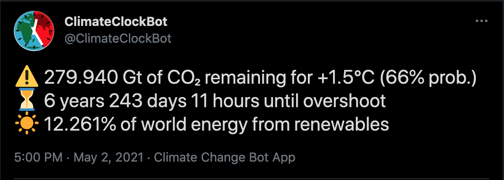

Climate Clock Bot
====================================

**This bot is deployed at: [twitter.com/ClimateClockBot](https://twitter.com/ClimateClockBot) and [botsin.space/@ClimateClockBot](https://botsin.space/@ClimateClockBot)**

A bot that tweets daily updates about worldwide CO₂ emissions relative to the [1.5°C carbon budget](https://www.ipcc.ch/sr15/chapter/spm/#article-spm-c) outlined by the IPCC.

A breakdown of the creative intent of this bot is posted on [my blog](http://gangles.ca/2021/05/15/climate-clock-bot/).

Methodology
====================================

The model and data for this bot are provided by the [Climate Clock](https://climateclock.world/) project’s [API](https://climate-clock.gitbook.io/climate-clock-docs/climate-clock-api).

Their countdown time is based on [two pieces of data](https://climateclock.world/science) provided by the IPCC. As of 2020, the world has a remaining budget of 400 gigatonnes of CO₂ for a 66% probability of remaining under +1.5˚C global average temperature. This budget is being depleted by emissions at a rate of 42 ± 3 gigatonnes of CO₂ per year. Putting these two together, scientists predict that the world will overshoot this limit around the middle of 2029.

The renewable energy percentage is based on the [“Our World In Data”](https://ourworldindata.org/renewable-energy#how-much-of-our-primary-energy-comes-from-renewables) open source database. According to their model, renewable energy provided 11.41% of global energy consumption in 2019. The annual growth is assumed to be 5.655%, which is the average growth rate in renewable energy share from 2016-2019. This rate is continuously updated with new yearly data in the Climate Clock API.